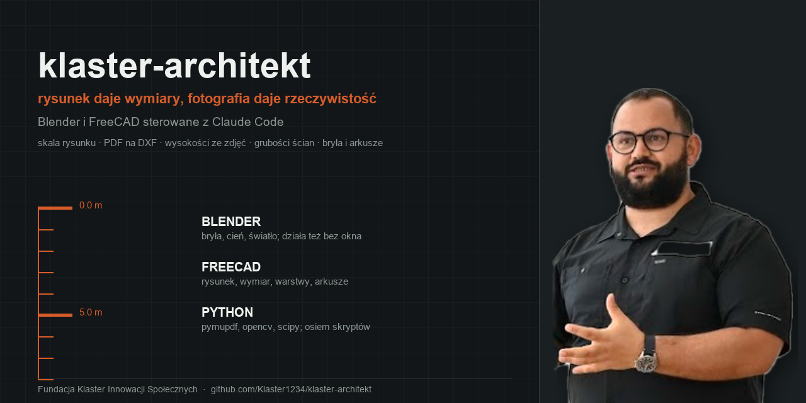

# klaster-architekt



Zestaw do pracy z rysunkami budowlanymi i fotografiami z wizji lokalnych, oparty
o dwa darmowe programy sterowane z Claude Code: **Blender** i **FreeCAD**.

Repo daje trzy rzeczy: instalator, który podpina oba programy jako konektory MCP,
skrypty do wyciągania wymiarów z rysunków i zdjęć, oraz skill z zasadami pracy.

## Instalacja

```powershell
powershell -ExecutionPolicy Bypass -File instalacja\instaluj.ps1
```

Instaluje Blendera i FreeCAD-a, wgrywa wtyczki MCP, ustawia automatyczny start
serwerów, tworzy skrót `Blender z MCP.bat` i rejestruje konektory. Po instalacji
zrestartuj sesję Claude Code.

```bash
python instalacja/sprawdz.py
```

Sprawdza, czy oba serwery odpowiadają: Blender na porcie 9876, FreeCAD na 9875.

## Dwa programy, dwie role

**Blender** liczy bryłę i światło. Buduje makietę z rzutu, robi badanie
nasłonecznienia, renderuje białe widoki. Działa też bez okna, w trybie `-b`,
co pozwala budować model skryptem w tle.

**FreeCAD** trzyma rysunek i wymiar. Wczytuje DXF z warstwami, pozwala mierzyć,
nazywać obiekty i wyprowadzać arkusze. Jego wtyczka wystawia XML-RPC, więc da się
nim sterować także wtedy, gdy konektor MCP nie wstanie.

## Zasada

**Rysunek daje wymiary, fotografia daje rzeczywistość.**

Z rzutu bierzesz geometrię, skalę i grubości. Ze zdjęć bierzesz to, co naprawdę
stoi na miejscu, i wysokości, bo rzut ich nie ma. Najczęstszy błąd to przeniesienie
z rzutu jego treści, czyli rozstawienia mebli i projektowanej zabudowy, i podanie
tego jako stanu istniejącego. Rzut projektowy pokazuje zamiar projektanta.

## Narzędzia

| Skrypt | Co robi |
|---|---|
| `narzedzia/skala.py` | Znajduje podziałkę liniową w PDF i zwraca punkty na metr |
| `narzedzia/pdf_do_dxf.py` | Wektorowy rzut PDF na warstwowy DXF w milimetrach, kolor kreski na warstwę |
| `narzedzia/rzut_arkusz.py` | Arkusz rzutu w skali z podziałką, kreska oryginalna |
| `narzedzia/wykryj_wat.py` | Wskazuje zdjęcia, na których wątek ceglany nadaje się na linijkę |
| `narzedzia/linijka_ceglana.py` | Mierzy wysokości ze zdjęcia, biorąc warstwę cegły 7,5 cm za moduł |
| `narzedzia/sciany_z_rzutu.py` | Paruje równoległe linie rzutu i wylicza grubości ścian |
| `narzedzia/bryla_blender.py` | Buduje bryłę w Blenderze z par ścian i słupów, w tle |
| `narzedzia/freecad_rpc.py` | Steruje FreeCAD-em przez XML-RPC, bez konektora MCP |

## Typowa kolejność

```bash
python narzedzia/skala.py rzut.pdf
python narzedzia/pdf_do_dxf.py rzut.pdf rysunek.dxf --skala 30.768 --x0 272.64 --y1 2241.38
python narzedzia/wykryj_wat.py foto/
python narzedzia/linijka_ceglana.py foto/sciana.jpg --pas 3000 120 1400 2000 --linijka 3060
python narzedzia/sciany_z_rzutu.py odcinki.json pary.json
blender -b --python narzedzia/bryla_blender.py -- pary.json slupy.json 3.50 model.blend
python narzedzia/freecad_rpc.py --dxf rysunek.dxf --doc Projekt --zapisz model.FCStd
```

## Czego ten zestaw nie zrobi

Nie zrobi wizualizacji fotorealistycznej. Naklejanie wycinków ze zdjęć na
prostopadłościany daje smugi i powtórzenia, sprawdzone i odrzucone. Model bryłowy
ma być białą makietą, a realizm bierze się z edycji samych fotografii.

Linijka ceglana działa tylko na płaszczyźnie, na której ją dopasowano, i tylko tam,
gdzie wątek mieści się w kadrze. Wierzchu wysokiego muru zwykle w kadrze nie ma i
wtedy wysokość jest założeniem, które trzeba w modelu opisać jako założenie.

## Wymagania

Python z `pymupdf`, `numpy`, `opencv-python`, `scipy`, `pillow`.
Blender 5.x, FreeCAD 1.1, `uv` w PATH, `winget` i `git` do instalatora.
