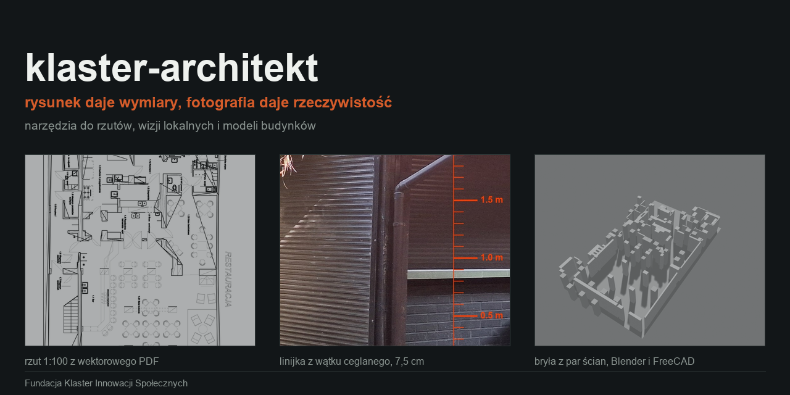

# klaster-architekt



Zestaw do pracy z rysunkami budowlanymi, fotografiami z wizji lokalnych i zamierzeniami budowlanymi,
oparty o dwa darmowe programy sterowane z Claude Code: **Blender** i **FreeCAD**, oraz o prosty model
w JSON — lokalu i całego zamierzenia — z którego powstają rysunki, zestawienia i planer 3D.

Repo daje:
- instalator, który podpina oba programy jako konektory MCP;
- skrypty do wyciągania wymiarów z rysunków, zdjęć, map, skanów i danych publicznych o działce;
- model lokalu i model zamierzenia z generatorami rysunków, zestawień, eksportem do DXF i GLB oraz
  planerem 3D w przeglądarce;
- skill `architekt`, który zamierzenie budowlane prowadzi etapami do projektu roboczego, i inne
  skille z zasadami pracy — Claude Code wczytuje je sam, gdy pasują do zadania.

Każde narzędzie działa samodzielnie, a zestaw nie narzuca procesu projektowego ani stylu. Wizualizacje
i kolorystyka są poza nim: model można wyeksportować do GLB i DXF i użyć w dowolnym programie.

## Architekt

Otwórz Claude Code w katalogu repozytorium i opisz temat — mieszkanie, ogród, dom, rozbudowę, taras
czy inne zamierzenie budowlane. Skill `architekt` rozpoznaje rodzaj zamierzenia, dobiera kartę wiedzy
technicznej i prawnej (`wnetrze`, `ogrod`, `budynek`, a dla innych tematów kartę ogólną) i prowadzi
przez etapy do projektu roboczego. Po każdym etapie inwestor akceptuje wynik, zanim praca idzie dalej.

| Etap | Co powstaje | Bramka |
|---|---|---|
| 0. Temat | `PROJEKT.md`, szkielet modelu | inwestor potwierdza temat |
| 1. Rozpoznanie | dane publiczne o działce, stan istniejący, program, inspiracje inwestora | inwestor akceptuje rozpoznanie i program |
| 2. Koncepcja | 2–3 warianty: plany, przekroje, bilans, model 3D, rekomendacja | inwestor wybiera wariant |
| 3. Projekt roboczy | dopracowany model, komplet arkuszy, lista do przekazania | inwestor akceptuje projekt roboczy |

Bez narzutu: architekt nie pracuje na gotowej galerii ani stylu. W rozpoznaniu pyta inwestora o
inspiracje kolorystyki i układu (zdjęcia, linki, miejsca — a także to, czego nie chce) i z nich
wyprowadza koncepcję; bez inspiracji zadaje pytania zamiast proponować styl. Kolory w modelu ustala
się z inwestorem, domyślnie są neutralne. Projekt roboczy nie zastępuje projektu sporządzonego przez
osobę z uprawnieniami — mówi to tabliczka każdego arkusza.

Dane inwestora trafiają do `projekty/<nazwa>/` (katalog `projekty/` jest wyłączony z gita):
`PROJEKT.md` (karta projektu), `model/` (pliki modelu), `zrodla/` (materiały źródłowe, tylko do
odczytu), `wyjscie/` (wyniki skryptów, generowane, nikt ich nie poprawia ręcznie).

Karty zamierzeń podają przepisy ze stanem na 26.09.2026; przed powołaniem trzeba sprawdzić aktualny
tekst, a warunki techniczne budynków są w okresie przejściowym (szczegóły w kartach).

Proces, karty i polecenia każdego etapu opisuje skill `architekt`; model i jego narzędzia — skille
`model-zamierzenia` i `modul-wnetrz` (niżej).

## Instalacja

```powershell
powershell -ExecutionPolicy Bypass -File instalacja\instaluj.ps1
```

Instaluje Blendera i FreeCAD-a, wgrywa wtyczki MCP, ustawia automatyczny start
serwerów, tworzy skrót `Blender z MCP.bat` i rejestruje konektory. Doinstalowuje
biblioteki Pythona z `requirements.txt`. Po instalacji zrestartuj sesję Claude Code.

```bash
python instalacja/sprawdz.py
```

Sprawdza, czy oba serwery odpowiadają: Blender na porcie 9876, FreeCAD na 9875.
Informacyjnie pokazuje też, czy są biblioteki Pythona, Blender do pracy w tle
(`bryla_blender.py`) i ODA File Converter (DWG).

Na macOS i Linuksie instalator nie działa; wystarczy `python3 -m pip install -r requirements.txt`,
Blender i FreeCAD z ich stron. Polecenia w tym pliku podane są jako `python`; na macOS zwykle `python3`.

## Dwa programy, dwie role

**Blender** liczy bryłę i światło. Buduje makietę z rzutu, robi badanie
nasłonecznienia, renderuje białe widoki. Działa też bez okna, w trybie `-b`,
co pozwala budować model skryptem w tle.

**FreeCAD** trzyma rysunek i wymiar. Wczytuje DXF z warstwami, pozwala mierzyć,
nazywać obiekty i wyprowadzać arkusze. Jego wtyczka wystawia XML-RPC, więc da się
nim sterować także wtedy, gdy konektor MCP nie wstanie.

## Zasada

**Rysunek daje wymiary, fotografia daje rzeczywistość.**

Z rzutu bierzesz geometrię, skalę i grubości. Ze zdjęć bierzesz to, co naprawdę
stoi na miejscu, i wysokości, bo rzut ich nie ma. Najczęstszy błąd to przeniesienie
z rzutu jego treści, czyli rozstawienia mebli i projektowanej zabudowy, i podanie
tego jako stanu istniejącego. Rzut projektowy pokazuje zamiar projektanta.

## Narzędzia

| Skrypt | Co robi |
|---|---|
| `narzedzia/skala.py` | Znajduje podziałkę liniową w PDF i zwraca punkty na metr |
| `narzedzia/pdf_do_dxf.py` | Wektorowy rzut PDF na warstwowy DXF w milimetrach, kolor kreski na warstwę |
| `narzedzia/rzut_arkusz.py` | Arkusz rzutu w skali z podziałką, kreska oryginalna |
| `narzedzia/wykryj_wat.py` | Wskazuje zdjęcia, na których wątek ceglany nadaje się na linijkę |
| `narzedzia/linijka_ceglana.py` | Mierzy wysokości ze zdjęcia, biorąc warstwę cegły 7,5 cm za moduł |
| `narzedzia/sciany_z_rzutu.py` | Paruje równoległe linie rzutu i wylicza grubości ścian |
| `narzedzia/bryla_blender.py` | Buduje bryłę w Blenderze z par ścian i słupów, w tle |
| `narzedzia/freecad_rpc.py` | Steruje FreeCAD-em przez XML-RPC, bez konektora MCP |
| `narzedzia/dwg_do_dxf.py` | Zamienia DWG na DXF przez ODA File Converter i raportuje warstwy, jednostki, zakres |
| `narzedzia/geoportal.py` | Działka, obrys budynku, budynki sąsiednie, ortofotomapa i wysokości z otwartych usług GUGiK |
| `narzedzia/zdjecie_prostuj.py` | Prostuje perspektywę zdjęcia płaszczyzny z 4 punktów znanego prostokąta i mierzy w skali |
| `narzedzia/raster_do_dxf.py` | Skan rysunku, karta sprzedażowa, zrzut mapy: kalibracja skali, linie, DXF |
| `narzedzia/przekroj_skanu.py` | Przekrój poziomy skanu 3D z telefonu (LiDAR) albo fotogrametrii, wysokość pomieszczenia |

## Typowa kolejność

```bash
python narzedzia/skala.py rzut.pdf
python narzedzia/pdf_do_dxf.py rzut.pdf rysunek.dxf --skala 30.768 --x0 272.64 --y1 2241.38
python narzedzia/wykryj_wat.py foto/
python narzedzia/linijka_ceglana.py foto/sciana.jpg --pas 3000 120 1400 2000 --linijka 3060
python narzedzia/sciany_z_rzutu.py odcinki.json pary.json
blender -b --python narzedzia/bryla_blender.py -- pary.json slupy.json 3.50 model.blend
python narzedzia/freecad_rpc.py --dxf rysunek.dxf --doc Projekt --zapisz model.FCStd
```

## Źródła mniej precyzyjne niż rysunek

Nie zawsze jest DWG. Przestrzeń da się odczytać z geoportalu, zdjęć, skanów i kart
sprzedażowych, ale każde źródło ma swoją dokładność i trzeba ją zapisać razem z wymiarem.

```bash
python narzedzia/geoportal.py --adres "Warszawa, Plac Defilad 1" --promien 40
python narzedzia/zdjecie_prostuj.py sciana.jpg --punkty 412,318 1630,352 1602,1190 398,1150 --wymiar 90 205
python narzedzia/raster_do_dxf.py karta.png --dwa-punkty 212,1040 2268,1040 --odleglosc 10.30
python narzedzia/przekroj_skanu.py skan.glb --h 1.2
python narzedzia/dwg_do_dxf.py rzut.dwg
```

Każde z tych narzędzi daje DXF w milimetrach, odcinki w formacie `sciany_z_rzutu.py`
i plik z metadanymi (źródło, data, dokładność). Pary ścian zamienia na ściany modelu
`lokal/z_par_scian.py`, który sam znajduje obrót budynku.

| Źródło | Orientacyjna dokładność |
|---|---|
| projekt DWG, pomiar laserowy | ok. 1 cm |
| skan LiDAR z telefonu | 2–5 cm |
| obrys budynku z ewidencji | od ok. 10 cm (pomiar geodezyjny) do metrów (stara digitalizacja) |
| ortofotomapa | 5–25 cm na piksel |
| skan rysunku, karta sprzedażowa | 1–5% |
| zdjęcie z modułem (cegła, płytka, drzwi) | 1–3%, tylko w płaszczyźnie modułu |

Ortofotomapa pokazuje dach, nie ściany: okap przesuwa obrys o 30–80 cm. Karta
sprzedażowa bywa obrócona i ma inne liczby niż rzut techniczny. Przekrój skanu łapie
też meble, więc skan pustego lokalu daje najczystszy obrys. Google Maps, Street View
i Google Earth służą do podglądu i pomiaru na własny użytek; takie wymiary to założenia,
a zrzutów ani obrysów z nich nie publikujemy i nie odrysowujemy do modelu.

## Model zamierzenia

Zamierzenie (ogród, budynek, rozbudowa, taras i inne) opisuje jeden plik JSON w centymetrach:
działka, teren, sąsiedztwo, plan miejscowy, poziomy, legenda projektu, obiekty (powierzchnia, linia,
punkt, bryła, dach), moduły wnętrz i przekroje; schemat opisuje `zamierzenie/SCHEMAT.md`. Model jest
**jedynym źródłem prawdy**: każdy stan — istniejący, koncepcje, projekt — to osobny plik z tymi
samymi id dla obiektów, które się nie zmieniają; wyników nikt nie poprawia ręcznie. `przyklad/ogrod/`
ma fikcyjną, neutralną działkę w czterech stanach: `istniejacy.json`, `koncepcja_A.json`,
`koncepcja_B.json`, `projekt.json`.

Legenda (kolory, kreskowanie, przynależność do bilansu i zestawień) należy do projektu, nie do kodu,
i domyślnie jest neutralna — odcienie szarości, jedna zieleń dla roślin; kolory ustala się z
inwestorem.

| Skrypt | Co robi |
|---|---|
| `zamierzenie/waliduj.py` | spójność modelu: id, kształty, dachy na prostokącie, obiekty w granicach działki, kolizje, poziomy, moduły |
| `rysunki/rozpoznanie.py` | R-01, plansza rozpoznania: działka, sąsiedztwo, warstwice, plan miejscowy, uwarunkowania |
| `rysunki/plan.py` | P-01, plan zamierzenia: obiekty według legendy, moduły, wymiary, odległości od granic, rzędne |
| `rysunki/roznica.py` | P-02, obiekty usunięte, nowe i zmienione między dwoma stanami (w ogrodzie: wycinka i nasadzenia) |
| `rysunki/cienie.py` | P-03, cienie brył, dachów, roślin i sąsiedztwa na teren dla wybranych dat i godzin |
| `rysunki/przekroj.py` | P-11, P-12…, przekroje i elewacje wzdłuż linii z sekcji `przekroje` |
| `rysunki/zestawienie.py` | Z-01, zestawienie według legendy (MD, CSV i arkusz): powierzchnie, długości, sztuki, atrybuty |
| `rysunki/bilans.py` | Z-02, bilans powierzchni (zabudowa, biologicznie czynna, utwardzenia, woda) na tle planu miejscowego |
| `rysunki/dxf.py`, `rysunki/glb.py` | rzut do CAD z warstwami na kategorię, makieta 3D — teren, obiekty, sąsiedztwo, moduły |

`rysunki/wszystko.py MODEL [MODEL…] --etap {rozpoznanie|koncepcja|projekt}` generuje od razu cały
komplet dla etapu i wypisuje tabelę kroków; wyniki trafiają do `wyjscie/` przykładu, poza gitem.

```bash
python rysunki/wszystko.py przyklad/ogrod/model/istniejacy.json --etap rozpoznanie
python rysunki/wszystko.py przyklad/ogrod/model/koncepcja_A.json przyklad/ogrod/model/koncepcja_B.json --etap koncepcja
python rysunki/wszystko.py przyklad/ogrod/model/projekt.json --istniejacy przyklad/ogrod/model/istniejacy.json
```

Pierwsze polecenie sprawdza stan istniejący i rysuje planszę rozpoznania; drugie liczy oba warianty
koncepcji naraz; trzecie dolicza różnicę względem stanu istniejącego, zestawienie, bilans, DXF i
model 3D — wyniki lądują w `przyklad/ogrod/wyjscie/`.

Gdy walidacja modelu zamierzenia nie przejdzie — także wtedy, gdy walidator lokalu (`lokal/waliduj.py`)
odrzuca moduł wnętrz — arkusze tego modelu nie powstają, a `wszystko.py` kończy się kodem 1. Rozbieżność
pola pomieszczenia z dokumentacją poprawia się w `pow_m2` albo oznacza polem `zmiana` pomieszczenia
(`lokal/SCHEMAT.md`).

## Moduł wnętrz

Lokal (mieszkanie, pojedyncza kondygnacja) opisuje jeden plik JSON w centymetrach: ściany, otwory,
pomieszczenia, aranżacja i punkty instalacji; kolory do podglądu są opcjonalne. Schemat opisuje
`lokal/SCHEMAT.md`. Jako **moduł wnętrz** lokal wpina się w model zamierzenia na wybranym poziomie
(sekcja `moduly`) — tak zbudowany jest `przyklad/mieszkanie/`: `model/lokal_projekt.json` i
`lokal_istniejacy.json` to sam lokal, a `model/projekt.json` i `istniejacy.json` to zamierzenie z
tym lokalem jako modułem.

| Skrypt | Co robi |
|---|---|
| `lokal/waliduj.py` | spójność odwołań i unikalność id, pola pomieszczeń zgodne z dokumentacją |
| `lokal/punkty.py` | każdy punkt elektryczny i wod-kan leży w swoim pomieszczeniu |
| `lokal/odleglosci.py` | kolizje mebli (z rozłącznymi wysokościami) i za wąskie przejścia |
| `lokal/zalozenia.py` | wysokości i wymiary do potwierdzenia pomiarem, zebrane w jedną listę |
| `lokal/rzedna.py` | dociąga zabudowy „do sufitu” do rzędnej sufitu (zapis tylko z `--zapisz`) |
| `rysunki/rzut.py` | A-01, rzut roboczy z wymiarem każdej ściany; „≈” przy wymiarach z niepewnych źródeł |
| `rysunki/karta_pomieszczenia.py` | KP-<nr>, aranżacja pomieszczenia z frontami, segmentami, łańcuchami i kontrolami |
| `rysunki/izometria.py` | A-03, izometria lokalu albo wybranych pomieszczeń |
| `rysunki/klady.py` | K-01…, kłady ścian z parami a·h przy punktach; K-00 zestawienie punktów bez kładu |
| `rysunki/wyburzenia.py` | A-02, plan wyburzeń i nowych ścian z różnicy dwóch stanów |
| `rysunki/dxf.py`, `rysunki/glb.py` | rzut do CAD w milimetrach z warstwami, makieta 3D z obiektami nazwanymi id z modelu |

```bash
python rysunki/wszystko.py przyklad/mieszkanie/model/lokal_projekt.json --istniejacy przyklad/mieszkanie/model/lokal_istniejacy.json
python rysunki/wszystko.py przyklad/mieszkanie/model/projekt.json --istniejacy przyklad/mieszkanie/model/istniejacy.json
```

Pierwsze polecenie liczy sam lokal — rzut, karty, kłady, izometrię, plan wyburzeń, DXF, GLB — do
`przyklad/mieszkanie/wyjscie/`; drugie liczy zamierzenie z modułem: plan P-01, DXF, makietę GLB i dane
planera, a dla modułu komplet rysunków lokalu pod przedrostkiem jego id. Różnicy, cieni, zestawienia i
bilansu to zamierzenie nie ma (bez działki, terenu i obiektów) — `wszystko.py` pomija te arkusze z adnotacją.

Arkusze mają tabliczkę z danymi z modelu, datę wygenerowania i status rysunku roboczego: nie
zastępują projektów branżowych. Zmiana idzie zawsze do modelu — wyniki przegenerowuje się skryptem.

## Planer 3D

```bash
python planer3d/serwer.py przyklad/ogrod/model/projekt.json przyklad/ogrod/model/koncepcja_A.json przyklad/ogrod/model/koncepcja_B.json
python planer3d/serwer.py przyklad/mieszkanie/model/lokal_projekt.json
```

Serwer wypisuje adres, domyślnie `http://127.0.0.1:8055/`; otwórz go w przeglądarce — obok siebie
zobaczysz rzut i widok 3D. three.js ładuje się z sieci, więc nic nie trzeba instalować. Gdy pierwszy
podany plik jest modelem zamierzenia, planer pokazuje działkę, teren, obiekty według legendy i moduły
wnętrz; gdy to model lokalu — sam lokal. Kolejne pliki są wariantami do przełączania w tym samym
kadrze (koncepcje albo stan istniejący kontra projekt). W Claude Code te same podglądy uruchamiają
`planer3d-ogrod` (port 8055) i `planer3d-mieszkanie` (port 8056) z `.claude/launch.json` (na Windows
warianty `-windows`).

Planer zamierzenia (ogród, działka, budynek):
- przeciąganie obiektów na rzucie i strzałkami (moduły wnętrz i sąsiedztwo stoją w miejscu);
- kontrole: odległość wybranego obiektu od granicy działki i od obiektu odniesienia wskazanego
  Shift+klikiem (z wymiarem na rzucie; Esc usuwa odniesienie), kolizje według legendy;
- zegar słoneczny według lokalizacji i północy z modelu, cienie na teren;
- przełącznik wariantów — kolejnych plików modelu podanych serwerowi.

Planer lokalu (moduł wnętrz):
- przestawianie i obracanie mebli, odległości do najbliższych przeszkód na rzucie;
- kontrole kolizji mebli, drzwi, okien i grzejników;
- spacer z wysokości dorosłego, siedzącego i dziecka, widok domku dla lalek;
- zegar słoneczny, światło sztuczne, warianty wykończenia z modelu i własne warianty układu;
- zapis kadru PNG bieżącego widoku 3D.

Planer nigdy nie zapisuje do modelu. Szkic trzyma w przeglądarce, a przycisk
„kopiuj zmiany dla Claude” daje JSON, który Claude nanosi na model.

## Skille

| Skill | Kiedy |
|---|---|
| `architekt` | prowadzenie zamierzenia etapami — temat, rozpoznanie, koncepcja, projekt roboczy — z kartami wiedzy dla każdego rodzaju |
| `model-zamierzenia` | model działki, budynku, ogrodu: legenda, teren, obiekty, stany i warianty, wszystkie narzędzia i arkusze |
| `modul-wnetrz` | lokal jako moduł wnętrz: rzuty, karty, kłady, plan wyburzeń, kontrole, dwa stany |
| `rysunki-i-modele` | rzut, skala, DXF, wysokości ze zdjęć, bryła; źródła mniej precyzyjne niż rysunek |

## Czego ten zestaw nie zrobi

Nie zrobi wizualizacji fotorealistycznej. Naklejanie wycinków ze zdjęć na
prostopadłościany daje smugi i powtórzenia, sprawdzone i odrzucone. Model bryłowy
ma być białą makietą, a realizm bierze się z edycji samych fotografii.

Linijka ceglana działa tylko na płaszczyźnie, na której ją dopasowano, i tylko tam,
gdzie wątek mieści się w kadrze. Wierzchu wysokiego muru zwykle w kadrze nie ma i
wtedy wysokość jest założeniem, które trzeba w modelu opisać jako założenie.

Model lokalu zna tylko ściany prostopadłe do jego osi. Budynek może być dowolnie
obrócony względem północy, ale ściany ukośne względem siebie trzeba przybliżyć;
bryłę takich budynków zbuduje `bryla_blender.py`, który kąty obsługuje.

Arkusze to rysunki robocze: nie zastępują projektów branżowych.

Poza zakresem zestawu: wizualizacje fotorealistyczne i palety kolorów (kolorystykę ustala się z
inwestorem), przedmiary i kosztorysy (także bilans mas ziemnych), zapytania ofertowe, dokumenty do
zgłoszenia albo pozwolenia na budowę oraz arkusze branżowe (elektryka, wod-kan, HVAC) i konstrukcja
(także więźba dachu). To zakres projektantów branżowych, konstruktora i osób z uprawnieniami —
architekt wypisuje, co im przekazać.

## Wymagania

Python 3.10+ z pakietami z `requirements.txt`: `pymupdf`, `numpy`, `opencv-python`, `scipy`,
`pillow`, `ezdxf`, `shapely` (2.1+), `trimesh`, `tzdata`, `certifi`.
Blender 5.x, FreeCAD 1.1, `uv` w PATH, `winget` i `git` do instalatora.
Opcjonalnie: ODA File Converter (DWG) i przeglądarka z dostępem do sieci (planer ładuje three.js z CDN).
